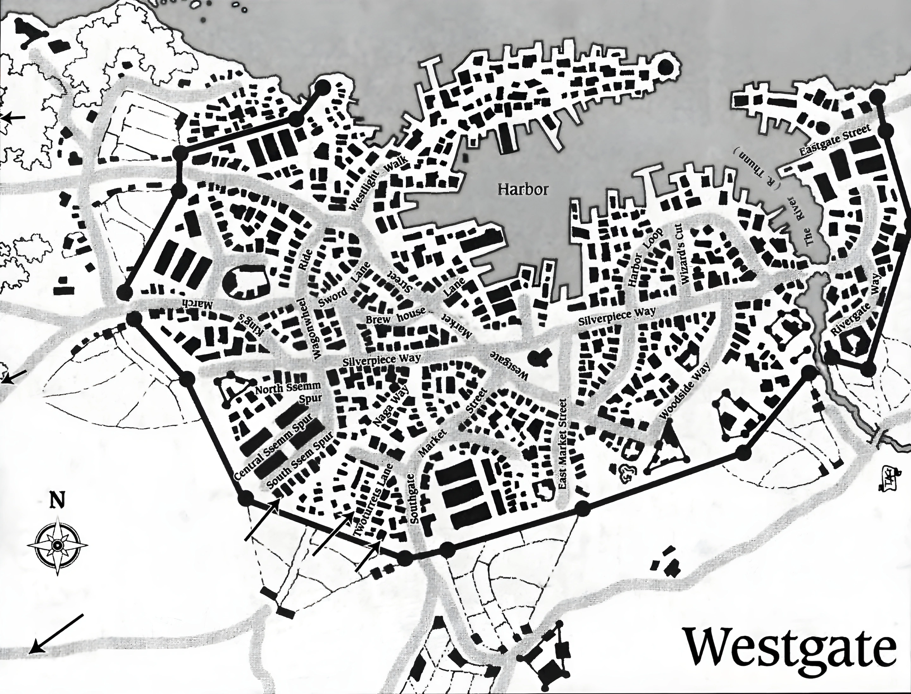

# Westgate
### Description:
A seedy and squalid metropolis—with a history in piracy, powerful crime syndicates, and nameless vampiric crime-lords. It thrives on black-market trade and corruption, and is perhaps one of the most sordid cities in all of Faerûn. The legacy of scoundrels and spies was found in every alley, and danger lurked for the unprepared in every corner. Despite this, it was the largest and most powerful city on the Dragon Coast. It is an open city that welcomed all travelers and citizens alike as long as they abided by the local laws and, of course, had enough coin. It is probably the oldest, richest and most corrupt port on the Sea of Fallen Stars. It received the nickname "Gateway to the West" from its role as the Inner Sea's most prolific port city.

"Ah, Westgate. They say that this is the city where anything goes and everything has a price, and that's pretty much the truth. It's the most powerful city on the Dragon Coast and the most ruthless. My advice is to watch your back at all times, or get someone to do it for you." -The First Mate of the Sea Serpent.
### Religion:
- Westhavians tolerated the worship of a wide variety of gods, including evil gods, and were proud of their openness.
- The city's corruption extended to religious matters also, with clerics of some temples secretly pocketing donations.
- Many temples were all too happy to sell spellcasting services or healing potions to adventurers, as a way to earn coin.
### Culture
- One local chapbook of note was a mean-spirited Ambritur's Whip. The publication was penned by anonymous contributors and focused on negative coverage of local establishments and events, as well as spreading gossip and rumors.
- Slang
	- Pigeon pinch: An ambush during which a courier is attacked by two groups of enemies: one to distract the target and its allies, the other to steal whatever it's carrying.
- A person from Westgate was known as a Westar or a Westhavian.
### Map:

### Locations:
#### Inns, Taverns, and Festhalls
- Bent Mermaid Inn
- Big Edna's Tavern
- The Black Boot
- Black Eye (tavern and festhall)
- Blais House Inn
- Blue Banner (tavern and inn in the Shou Quarter)
- The Empty Fish Tavern
- The Gatereach Inn
- Gentle Moon Inn
- Jolly Warrior Inn
- Leaning Man Inn
- Lilda's (festhall in The Shore ward)
- The Old Beard Tavern
- Purple Lady Festhall (owned by Ilira Nathalan)
- Rising Raven Inn and Rooming House
- The Rosebud Tavern
- Rotten Root Tavern
- The Spitting Cockatrice (inn)
- The Westward Eye (inn)
#### Shops
- Aurora's Emporium: curio shop
- Gondeth's Mageries: magic shop
- House of Silks: fine textiles shop
- Chalaratha's Fragrances: perfume shop and factory
- Dawn's Dress Shop
- Imryth Tower (residence of Audara Imryth, potion shop, and Harper safehouse)
- Myrkeer House: merchant house of Shalush Myrkeer
- The Blind Eye: tack, harness, and trail goods shop; major fence of stolen goods.
#### Temples to Good Gods
- Morningstar Haven: Temple of Lathander
- Fortuneboon Hall: Temple of Tymora
- House of Ilmater: Temple of Ilmater
- Abbey of the Blinding Truth: Temple of Tyr
- A shrine to Sune
- A shrine to Chauntea could be found in the Eastern part of the city
#### Temples to Neutral Gods
- House of the Sun: Temple of Amaunator
- House of the Wheel: Temple of Gond
- The Hidden House: Temple of Leira (subterranean)
- House of Steel: Abandoned Temple of Garagos
#### Temples to Evil Gods
- Whitecap Hall: Temple of Umberlee
- House of Winds: Temple of Talos
- Painbliss Hall: Temple of Loviatar
- The Place of Waiting Death: Temple of Talona (subterranean)
- House of Spires and Shadows: Temple of Mask; also called The Shadowspires. Abandoned circa 1480 DR.
#### Other Locations
- Westlight: The Harbor Tower lighthouse.
- Westgate's stout city walls had six gates. Counter-clockwise from the northernmost gate:
	- The Water Gate
	- The West Gate
	- Mulsantir's Gate
	- The South Gate
	- The River Gate
	- The East Gate.
- The Shore: A slum district, just outside The Water Gate.
- Shou Quarter: District home of many immigrants from Shou.
- Castle Thalavar: Gedrin Thalavar's childhood home and headquarters of the Eye of Justice.
- Tidetown: New dock district built after the sea level of the Sea of Fallen Stars dropped.
- Darkdance Manor: Home of House Darkdance and ancestral home of Myrin Darkdance.
- Timeless Blade: A Fencing school.
- The Quivering Thumb: Gladiatorial games with gambling.
### Notable Inhabitants
- Gedrin Thalavar: Founder of the Eye of Justice.
- Verovan Lorndessar: last King of Westgate who during a ship race against the Red Wizards of Thay was tricked into turning his whole crew into stone; the Red Wizards had secretly replaced his whip with one braided with a cockatrice feather.
- Mintassan the Magnificent: a planewalker and sage.
### Organizations and Factions:
- Eye of Justice: Paladin order dedicated to the worship of the Threefold God.
- Fire Knives: Assassins' guild at war with the Nine Golden Swords.
- Kraken hunters: Mercenaries who styled themselves as the best defense for merchant ships against the aberrations of the Abolethic Sovereignty.
- Night Masks: Thieves guild supposedly driven out of Westgate by the Eye of Justice in 1391 DR
- Nine Golden Swords: Shou organization with criminal roots by way of Telflamm; opposes the Fire Knives.
- Zhentarim: A mercenary company.
- Mercenaries' Guild of Westgate: A mercenary company.
### Noble Houses:
- Athagdal: symbol is a set of russet weighing scales
- Bleth: symbol is seven suns
- Cormaeril: symbol is a red wyvern and a silver horn
- Dhostar (defunct): symbol was a wagon wheel topped with three stars
- Guldar: symbol is a black hawk
- Malavhan: symbol is a red sun
- Ssemm: symbol is an ivory bird's claw
- Thalavar: symbol is a green feather
- Thorsar: symbol is a blue hand holding corn
- Urdo: symbol is a yellow eye
- Vhammos: symbol is a steel-gray open hand